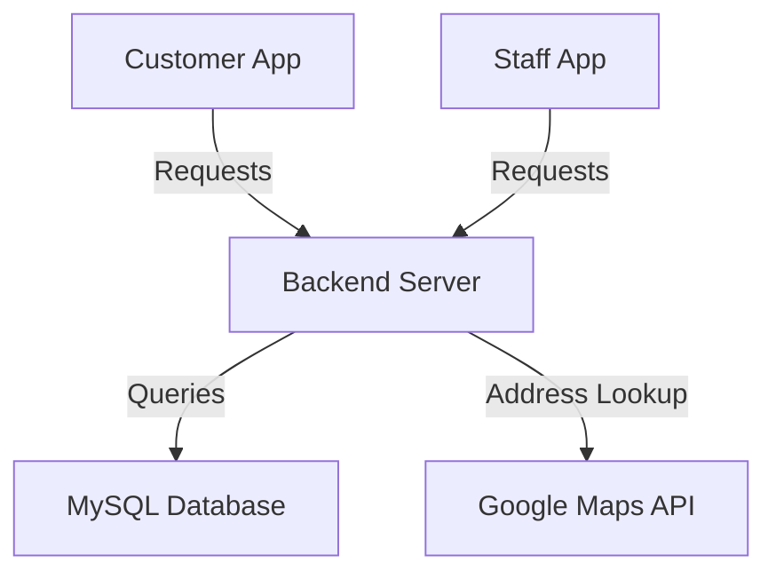

# BITP 3123 DISTRIBUTION APPLICATION DEVELOPMENT
## GROUP PROJECT TITLE: 
LaundryGo: Smart Laundry Pickup and Delivery System
## Introduction
In today's fast-paced environment, managing daily chores like laundry can be especially tedious especially for working professionals. Traditional laundry services typically require in-person visits or at the very list we need to contact them through calls which we can made only during office hours time, which are often inconvenient and time-consuming. To simplify this, we purpose LaundryGo, a smart Laundry Pickup and Delivery System that enables users to schedule laundry services online at anywhere anytime and receive clean clothes at their doorstep-all through a digital platform.

The system streamlines laundry management by offering a centralized solution that connects customers and service staff, improving operational efficiency an denhancing overall customer experience.

## Project Overview
LaundryGo is a cross-functional digital system designed to modenize laundry services through automation and remote accessibility. it consists of two Java-based desktop applications, one for customers and one for staff. Both applications connected to a PHP backend server with a MySQL database.

The purpose of this project is to address common issues with traditional laundry services, such as lack of scheduling flexibility, poor transparency in service progress and the inefficeiny of manual tracking. By offering an intuitive platform with real-time booking and management features, LaundryGo aims to make laundry services more accessible and convenient for both users and service providers.

### Core Problem It Solves
* Reduces the need for physical visits to laundry shops
* Eliminates confusion or delays caused by manual booking systems
* Enhances communication and transparency between customers and staff
* Provides a centralized system for eficient service management

## Commercial Value and Third-Party Integration
### Commercial Value
LaundryGo has real-world commercial potential, particularly in urban settings, student housing, and residential communities. It caters to a growing demand for on-demand laundry services and can be adopted by:

* Local laundromats looking to expand digitally.
* Dormitories and apartment complexes offering value-added services.
* Delivery service providers entering niche markets like laundry logistics.

The modular design also allows future integration of features like online payments, real-time notifications, and performance analytics, making the platform scalable for commercial use.

## Third-Party Integration
The system integrates with Google Maps API in the staff application to assist in:
* Locating customer addresses
* Route planning for laundry pickups and deliveries
* Verifying address data entered by customers

### Why Google Maps?
* It enhances delivery efficiency by providing accurate geographic data
* It supports better service planning and staff allocation
* It reduces errors related to incorrect or ambiguous address entries

## System Architecture Overview

This system includes two frontend applications (for students and staff), a backend server, a shared database, and an external integration with the Google Maps API.

## Backend Application
### Technology Stack
* Language: PHP
* Framework: None
* Database: MySQL
* API Format: RESTful (JSON)

### API Documentation
| Endpoint               | Method                | Description                                    | Request Parameters                                                           | Success Response                                                             | Error Response                                            | Security                                      |
| ---------------------- | --------------------- | ---------------------------------------------- | ---------------------------------------------------------------------------- | ---------------------------------------------------------------------------- | --------------------------------------------------------- | --------------------------------------------- |
| `/signup.php`          | `POST`                | Register a new user                            | `name`, `email`, `password`, `phone`, `address` (as `x-www-form-urlencoded`) | `{"status":"success","message":"User registered successfully.","user_id":1}` | `{"status":"error","message":"Missing required fields."}` | Passwords hashed using `password_hash()`    |
| `/login.php`           | `POST`                | Login user                                     | JSON: `email`, `password`                                                    | `{"success":true,"id":1,"name":"John"}`                                      | `{"success":false,"message":"Invalid password."}`         | Passwords verified with `password_verify()` |
| `/staff_signup.php`    | `POST`                | Register staff                                 | JSON: `username`, `password`                                                 | `{"success":true,"message":"Staff registered successfully!"}`                | `{"success":false,"message":"Missing fields."}`           | Passwords hashed                            |
| `/staff_login.php`     | `POST`                | Staff login                                    | JSON: `username`, `password`                                                 | `{"success":true,"staff_id":1}`                                              | `{"success":false,"message":"User not found."}`           | Passwords verified                          |
| `/confirm_booking.php` | `POST`                | Register customer manually (legacy)            | `name`, `email`, `password`, `phone`, `address` (as form data)               | `{"status":"success","message":"User registered"}`                           | `{"status":"error","message":"Missing parameters"}`       | Passwords not hashed  |
| `/create_order.php`    | `POST`                | Create laundry order                           | JSON: `user_id`, `service_id`, `weight_kg`, `time_slot`, `notes`             | `{"success":true}`                                                           | `{"success":false,"error":"<error>"}`                     | No authentication                          |
| `/getservice.php`      | `GET`                 | Get all services                               | –                                                                            | JSON array of services                                                       | –                                                         | Public endpoint                             |
| `/get_price.php?id=1`  | `GET`                 | Get price for a service                        | URL param: `id`                                                              | `{"price_per_kg":3.5}`                                                       | `{"error":"No price found in database."}`                 | Public endpoint                             |
| `/get_laundry.php`     | `GET`                 | List laundry orders with service and user info | –                                                                            | Array of orders                                                              | –                                                         | Public endpoint                             |
| `/get_order.php`       | `GET`                 | Get orders with user address                   | –                                                                            | `{"success":true,"orders":[...]}`                                            | –                                                         | Public endpoint                             |
| `/update_status.php`   | `PUT` (via JSON POST) | Update laundry order status                    | JSON: `id`, `status`                                                         | `{"success":true}`                                                           | `{"success":false,"message":"Missing data"}`              | No auth on who updates                      |

## Frontend Application
### Customer App 
* Purpose: Enables students to register, log in, and make laundry bookings.
* Technology: Java (Swing UI), JSON handling via org.json
* API Integration: Communicates with backend using HttpURLConnection, sending and receiving JSON data.

### Staff App
* Purpose: Allows staff to view bookings, update statuses, and view delivery addresses.
* Technology: Java (Swing UI), JSON + Google Maps API
* API Integration: Similar to student app + includes Google Maps integration for address visualization.

## Use Case Diagram
